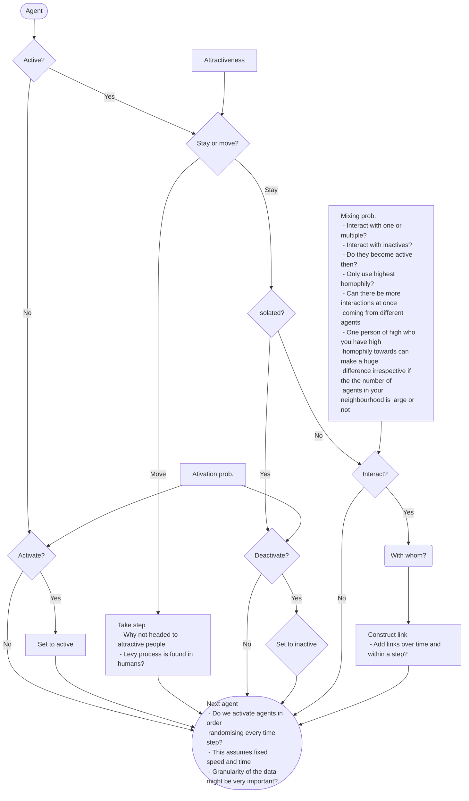

```mermaid
    flowchart TD
        agent([Agent])-->active{Active?}
        active-->|No|notactive{Activate?}
        active-->|Yes|move{Stay or move?}

        notactive-->|Yes|activate[Set to active]
        
        move-->|Move|actualmove[Take step \n - Why not headed to attractive people \n - Levy process is found in humans?]
        style actualmove text-align:left
        move-->|Stay|isolated{Isolated?}
        
        isolated-->|Yes|deactivate{Deactivate?}
        isolated-->|No|staying{Interact?}

        deactivate-->|Yes|inactive{Set to inactive}
        staying-->|Yes|interactant(With whom?)
        interactant-->link[Construct link \n - Add links over time and within a step?]
        style link text-align:left

        activationprob[Ativation prob.]-->notactive
        activationprob-->deactivate
        attractiveness[Attractiveness]-->move
        mixing[Mixing prob. \n - Interact with one or multiple? \n - Interact with inactives? \n - Do they become active then? \n - Only use highest homophily? \n - Can there be more interactions at once \n coming from different agents \n - One person of high who you have high \n homophily towards can make a huge \n difference irrespective if the the number of \n agents in your neighbourhood is large or not]-->staying
        style mixing text-align:left

        notactive-->|No|next([Next agent \n - Do we activate agents in order \n randomising every time step? \n - This assumes fixed speed and time \n - Granularity of the data might be very important?])
        style next text-align:left
        activate-->next
        actualmove-->next
        deactivate-->|No|next
        inactive-->next
        staying-->|No|next
        link-->next
```